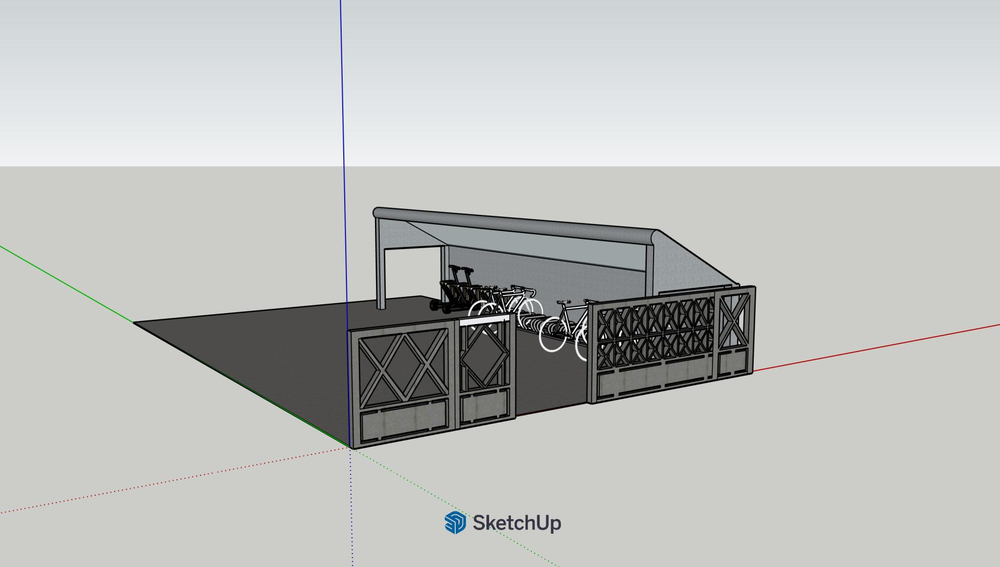
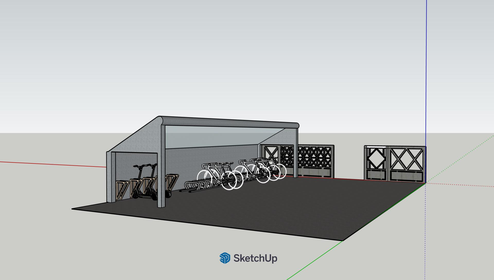
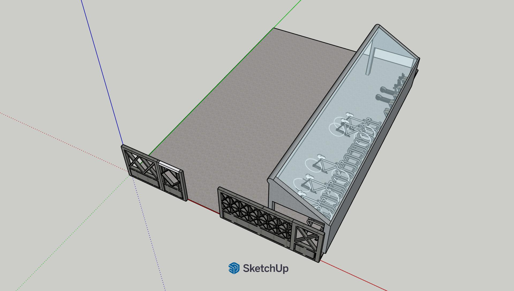
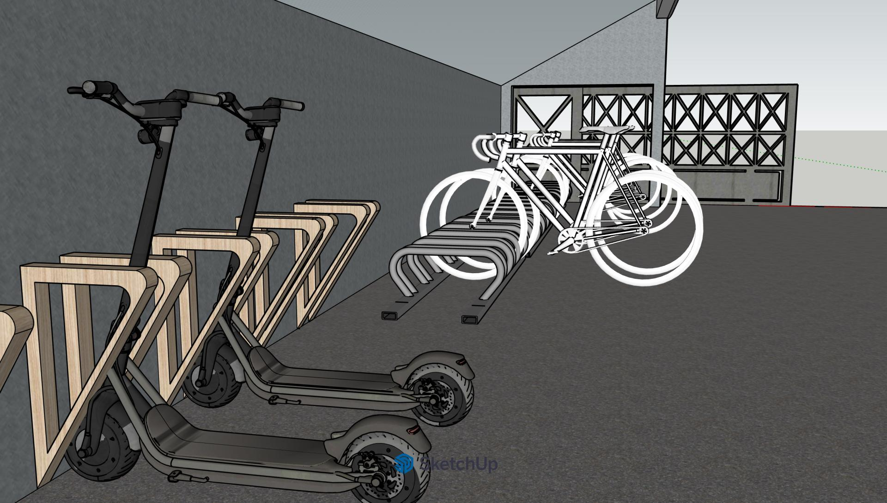

# sketchup-parking-project

A voluntary 3D design and modeling project developed in **SketchUp** to address the lack of sustainable mobility parking at **Lope de Vega International School**.

As a regular electric scooter user, I identified the need, designed a proposal considering **space layout, accessibility, and capacity**, and presented it to the school.

The proposal was accepted and implemented, and the school now has a parking area with a design closely resembling the original concept.

## Design Proposal

  
  
  
  

## Final Result

  
  

